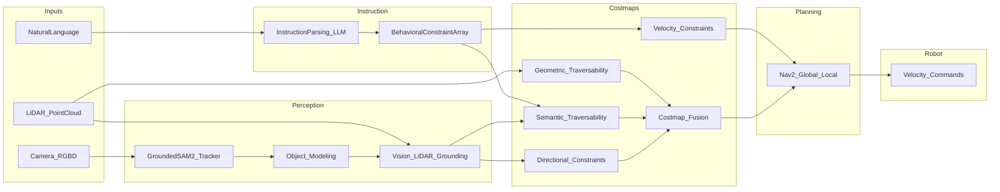

# NORM-Nav

<p align="center">
  <a href="ICRA26_2253_FI.pdf">Paper PDF</a> ·
  <a href="https://ei-nav.github.io/NORM-Nav">Project Website</a> ·
  <a href="#paper-and-citation">Citation</a> ·
  <a href="LICENSE">License</a>
</p>

<p align="center">
  
  
  
  
  
  
</p>

---

## Table of Contents

- [Overview](#overview)
- [Key Features](#key-features)
- [System Architecture](#system-architecture)
- [Repository Layout](#repository-layout)
- [Requirements](#requirements)
- [Installation](#installation)
- [Quick Start](#quick-start)
- [Behavioral Instruction Example](#behavioral-instruction-example)
- [Configuration (pointers)](#configuration-pointers)
- [Paper and Citation](#paper-and-citation)
- [Contributing](#contributing)
- [Acknowledgements](#acknowledgements)
- [License](#license)

---

## Overview

**NORM-Nav** is motivated by a simple gap in real-world robot navigation: collision-free planning alone is not enough when people expect socially and contextually appropriate behavior, so robots need to understand natural-language intentions (e.g., preferred side, speed, or proximity) and turn them into actionable navigation preferences.

---

## Key Features

- **Natural-language behavioral constraints** parsed into structured fields (object, direction, velocity, traversability); see [`src/human_robot_interaction/navibot_instruction_parsing/README.md`](src/human_robot_interaction/navibot_instruction_parsing/README.md).
- **Semantic perception** via GroundingDINO + SAM2 ROS 2 node; see [`src/perception/navibot_grounded_sam2/README.md`](src/perception/navibot_grounded_sam2/README.md).
- **Multi-layer costmaps**: geometric traversability, semantic traversability, directional preferences, velocity modulation, and fusion into behavior-aware maps for planning; see [`src/perception/navibot_costmap/README.md`](src/perception/navibot_costmap/README.md).
- **Classic stack** (geometry + Nav2 only) and **NORM-Nav stack** (full perception + behavioral layers) via different bringup launches.
- **Simulation** (Gazebo worlds `SMALL_OSM` / `MEDIUM_OSM` / `LARGE_OSM`) and **real robot** bringup (e.g., Livox MID-360).

---

## System Architecture



---

## Repository Layout

High-level map of `src/` (not every file shown):

```text
NORM-Nav/
├── src/
│   ├── navibot_bringup/          # Launch files, URDF, RViz, sim/real YAML
│   ├── localization/
│   │   ├── FAST_LIO/             # Submodule: FAST-LIO2 (ROS 2 branch)
│   │   └── navibot_lio_interface/
│   ├── perception/
│   │   ├── navibot_costmap/      # Layers + fusion (NORM-Nav costmaps)
│   │   ├── navibot_pointcloud_to_laserscan/
│   │   ├── navibot_grounded_sam2/
│   │   └── navibot_object_modeling/
│   ├── navigation/
│   │   └── navibot_navigation/   # Nav2 launches and integration
│   ├── human_robot_interaction/
│   │   └── navibot_instruction_parsing/
│   ├── simulation/
│   │   ├── navibot_simulation/
│   │   └── livox_laser_simulation_RO2/
│   ├── sensors/
│   │   └── livox_ros_driver2/
│   └── utilities/
│       ├── navibot_interfaces/
│       └── waypoint_rviz_plugin/
```

---

## Implementation Environment

This project is implemented and validated primarily on **Ubuntu 22.04 + ROS 2 Humble**, with **Gazebo Classic 11** for simulation and **Livox MID-360** in real-robot setups; for the full vision-enhanced NORM-Nav pipeline, an RGB-D camera and NVIDIA GPU (CUDA) are typically used.

---

## Installation

### 1. Clone and submodules

```bash
git clone git@github.com:EI-Nav/NORM-Nav.git
cd NORM-Nav
git submodule update --init --recursive
```

`FAST_LIO` is a git submodule under `src/localization/FAST_LIO` (see [`.gitmodules`](.gitmodules)).

### 2. Gazebo models (required for simulation)

Download the model bundle and extract into `~/.gazebo/`.

- **Baidu Netdisk:** [models.zip](https://pan.baidu.com/s/18WAD07o4Atq-VIlY6ktmDw?pwd=ftzc) · password: `ftzc`

The archive may include models not used by every world; place extracted files under `~/.gazebo/`.

### 3. Livox SDK2

```bash
git clone https://github.com/Livox-SDK/Livox-SDK2.git
cd Livox-SDK2
mkdir build && cd build
cmake .. && make -j$(nproc)
sudo make install
cd ../..
```

### 4. ROS dependencies and build

```bash
./build_dependencies.sh  # rosdep from workspace
./build_project.sh       # colcon release build
source install/setup.bash
```

### 5. Behavioral / vision pipeline (required for NORM-Nav)

Follow package docs for conda/PyTorch and Grounded SAM2 setup:

- [`src/perception/navibot_grounded_sam2/README.md`](src/perception/navibot_grounded_sam2/README.md)
- [`src/human_robot_interaction/navibot_instruction_parsing/README.md`](src/human_robot_interaction/navibot_instruction_parsing/README.md)

---

## Quick Start

After `source install/setup.bash`:

If you will use natural-language instruction parsing, set the API key before launching related nodes:

```bash
export LLM_API_KEY="<your_api_key>"
```

<details>
<summary><strong>Simulation - NORM-Nav</strong></summary>

```bash
ros2 launch navibot_bringup norm_nav_bringup_sim.launch.py \
    world:=MEDIUM_OSM \
    lio_rviz:=False \
    nav_rviz:=True \
    use_sim_time:=True
```

</details>

<details>
<summary><strong>Real robot - NORM-Nav</strong></summary>

```bash
ros2 launch navibot_bringup norm_nav_bringup_real.launch.py \
    lio_rviz:=False \
    nav_rviz:=True
```

</details>

**World options (simulation):** `SMALL_OSM`, `MEDIUM_OSM`, `LARGE_OSM`.

### Human-Robot Interaction (start node + terminal interaction)

The main bringup launches NORM-Nav stacks, while natural-language interaction requires an additional instruction parsing node.

Recommended startup order (3 terminals):

1. **Terminal A**: start NORM-Nav (simulation or real robot)
2. **Terminal B**: start instruction parsing node
3. **Terminal C**: start interactive instruction publisher (type in terminal)

```bash
# Terminal B: instruction parsing node
ros2 launch navibot_instruction_parsing instruction_parsing.launch.py
```

```bash
# Optional: one-off key override (do not commit to files)
ros2 launch navibot_instruction_parsing instruction_parsing.launch.py \
  --ros-args -p llm.api_key:=<your_api_key>
```

```bash
# Terminal C: interactive instruction input
ros2 run navibot_instruction_parsing instruction_publisher_node
```

After `instruction_publisher_node` starts, type natural-language instructions directly in the terminal (e.g., "Please walk on the right side of the car."). Type `quit` to exit.

You can also publish the same example directly from CLI:

```bash
ros2 topic pub --once /behavioral_instructions navibot_interfaces/msg/BehavioralInstruction \
  "{header: {stamp: {sec: 0, nanosec: 0}, frame_id: 'map'}, online_constraints: ['Please walk on the right side of the car.'], offline_constraints: []}"
```

---

Full ROS 2 topics, services, and parameters: [`src/human_robot_interaction/navibot_instruction_parsing/README.md`](src/human_robot_interaction/navibot_instruction_parsing/README.md).

Message definitions: [`src/utilities/navibot_interfaces/README.md`](src/utilities/navibot_interfaces/README.md).

---

## Configuration (pointers)

| Area                                         | Paths                                                                                                                                                                                                                                                  |
| -------------------------------------------- | ------------------------------------------------------------------------------------------------------------------------------------------------------------------------------------------------------------------------------------------------------ |
| FAST-LIO2                                    | [`src/navibot_bringup/config/simulation/fastlio_mid360_sim.yaml`](src/navibot_bringup/config/simulation/fastlio_mid360_sim.yaml), [`src/navibot_bringup/config/reality/fastlio_mid360_real.yaml`](src/navibot_bringup/config/reality/fastlio_mid360_real.yaml) |
| Nav2                                         | [`src/navibot_bringup/config/simulation/nav2_params_sim.yaml`](src/navibot_bringup/config/simulation/nav2_params_sim.yaml), [`src/navibot_bringup/config/reality/nav2_params_real.yaml`](src/navibot_bringup/config/reality/nav2_params_real.yaml) |
| Classic geometric costmap (package defaults) | [`src/perception/navibot_costmap/config/geometric_traversability_costmap_params.yaml`](src/perception/navibot_costmap/config/geometric_traversability_costmap_params.yaml)                                                                                     |
| NORM-Nav costmaps (sim)                      | [`src/navibot_bringup/config/simulation/costmap/`](src/navibot_bringup/config/simulation/costmap/)                                                                                                                                                     |
| NORM-Nav costmaps (real)                     | [`src/navibot_bringup/config/reality/costmap/`](src/navibot_bringup/config/reality/costmap/)                                                                                                                                                           |

---

## Paper and Citation

**Title:** NORM-Nav: Zero-Shot Mobile Robot Navigation with Natural Language Behavioral Constraints.

**Project website:** <https://ei-nav.github.io/NORM-Nav>

A manuscript PDF is bundled as [`ICRA26_2253_FI.pdf`](ICRA26_2253_FI.pdf).

arXiv preprint: coming soon

```bibtex
@inproceedings{huo2026norm_nav,
  title     = {NORM-Nav: Zero-Shot Mobile Robot Navigation with Natural Language Behavioral Constraints},
  author    = {TBA},
  booktitle = {IEEE International Conference on Robotics and Automation (ICRA)},
  year      = {2026},
  note      = {To appear / under review},
  eprint    = {TBA},
  archivePrefix = {arXiv},
  primaryClass = {cs.RO}
}
```

---

## Contributing

Contributions are welcome via **GitHub Issues** and **pull requests**. For roadmap ideas (extra LiDAR support, richer docs, benchmarks), please use the issue tracker rather than informal TODO lists in this file.

---

## Acknowledgements

This work builds on excellent open-source projects, including:

- [FAST-LIO2](https://github.com/hku-mars/FAST_LIO)
- [Grounded SAM / SAM2 ecosystem](https://github.com/IDEA-Research/Grounded-SAM-2)
- [light-map-navigation](https://github.com/EI-Nav/light-map-navigation)

---

## License

The **root** project is released under the [MIT License](LICENSE). Third-party and submodule components remain under their respective licenses.